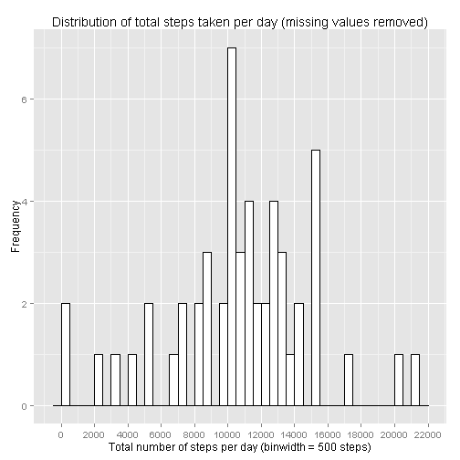
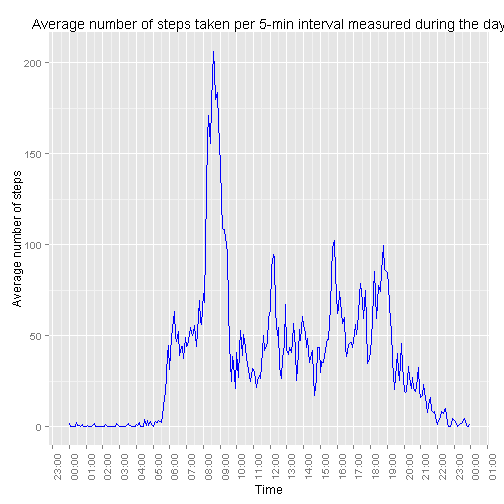
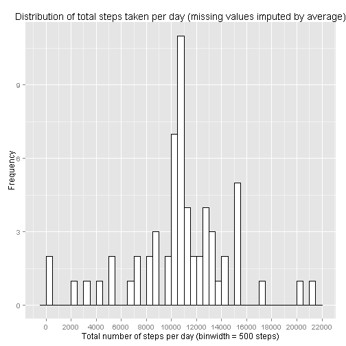
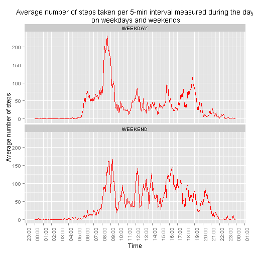

## Reproducible Research: Peer Assessment 1
Dataset used in this report contains measurements from a personal activity monitoring device. This device collects data at 5 minute intervals through out the day. The data consists of two months of data from an anonymous individual collected during the months of October and November, 2012 and include the number of steps taken in 5 minute intervals each day. The dataset can be downloaded from https://d396qusza40orc.cloudfront.net/repdata%2Fdata%2Factivity.zip  

The variables included in this dataset are:

-  **steps**: Number of steps taking in a 5-minute interval (missing values are coded as NA)
-  **date**: The date on which the measurement was taken in YYYY-MM-DD format
-  **interval**: Identifier for the 5-minute interval in which measurement was taken

The dataset is stored in a comma-separated-value (CSV) file and there are a total of 17,568 observations in this dataset.

## Loading and preprocessing the data

CSV file with activity measurements had been placed into current workspace in R Studio. Data frame *full_set* is loaded using read.csv function:


```r
full_set<-read.csv("activity.csv")
```
For the purposes of the initial analysis data frame *set_wout_na* is created with rows with missing steps values removed:


```r
set_wout_na<-subset(full_set,complete.cases(full_set[,1]))
```

Data set with missing values removed has 15,264 observations. 

```r
nrow(set_wout_na)
```

```
## [1] 15264
```


The following R libraries are going to be used for data analysis


```r
library(plyr)
library(ggplot2)
library(scales)
```


## What is mean total number of steps taken per day?

#### Analysis steps ####
Data set with missing values removed (*set_wout_na*) is used for this analysis.

1. Create new data frame *total_by_day* using function ddply with variable **steps** summarized accros **date** values and stored as **totalSteps**:


```r
total_by_day<-ddply(set_wout_na, c("date"), summarise, totalSteps = sum(as.numeric(steps)))
```

2. Create histogram for distribution of total number of steps taken per day using ggplot2 library

```r
g1<-ggplot(total_by_day, aes(x=totalSteps)) + geom_histogram(binwidth=500,color="black", fill="white")
g1<-g1 + labs(title = 'Distribution of total steps taken per day (missing values removed)',x = 'Total number of steps per day (binwidth = 500 steps)', y = 'Frequency')
g1<-g1+scale_x_continuous(breaks=seq(0,30000,by=2000))
g1
```

 


3. Calculate mean of total number of steps taken per day:

```r
mean(total_by_day$totalSteps)
```

```
## [1] 10766.19
```
Mean of total number of steps taken per day is 10,766.19

4. Calculate median of total number of steps taken per day:

```r
median(total_by_day$totalSteps)
```

```
## [1] 10765
```
Median of total number of steps taken per day is 10,765


## What is the average daily activity pattern?
#### Analysis steps ####
Data set with missing values removed (*set_wout_na*) is used for this analysis.

1. Create new data frame *mean_by_interval* with average number of steps per each 5-min interval using function ddply with variable **steps** averaged accros **interval** values and stored as **meanSteps**:

```r
mean_by_interval<-ddply(set_wout_na, c("interval"), summarise, meanSteps = mean(as.numeric(steps)))
```

2. Add column with interval value converted to time variable. Example: value 355 is converted to 03:55.

```r
mean_by_interval <-mutate(mean_by_interval,time_interval= strptime(sprintf("%02d:%02d", interval %/% 100,interval %% 100), format="%H:%M"))
```

3. Make time series plot of the 5-minute interval (**time_interval** on x-axis) and the average number of steps taken averaged across all days (**meanSteps** on y-axis)

```r
g2 <- ggplot(mean_by_interval, aes(time_interval, meanSteps))
g2 <- g2 + geom_line(color = 'blue')
g2 <- g2 + scale_x_datetime(breaks = date_breaks("60 min"), minor_breaks = date_breaks("30 min"), labels=date_format("%H:%M"))
g2 <- g2 + theme(axis.text.x = element_text(angle = 90))
g2 <- g2 + labs(title = 'Average number of steps taken per 5-min interval measured during the day',x = 'Time', y = 'Average number of steps')
g2
```

 

4. Find 5-minute interval, on average across all the days in the dataset, that contains the maximum number of steps

```r
mean_by_interval[which.max(mean_by_interval$meanSteps),1]
```

```
## [1] 835
```
08:30-08:35 interval contains maximum number of steps taken


## Imputing missing values
#### Analysis steps ####
Original dataset (*full_set*) is used for this analysis.

1.  Calculate and report the total number of missing values in the dataset (i.e. the total number of rows with NAs)

```r
length(which(is.na(full_set$step)))
```

```
## [1] 2304
```
Dateset has 2,304 rows with missing values.

2. Create new dataset **i_full_set** with imputed values - missing steps value is replaced with average number of steps for that interval across all days

```r
i_full_set <- ddply(full_set, .(interval), function(df) {df$steps[is.na(df$steps)] <- mean(df$steps, na.rm=TRUE); return(df)})
```

3. Create new data frame *i_total_by_day* from imputed dataset using function ddply with variable **steps** summarized accros **date** values and stored as **totalSteps**:


```r
i_total_by_day<-ddply(i_full_set, c("date"), summarise, totalSteps = sum(as.numeric(steps)))
```

4. Create histogram for distribution of total number of steps taken per day for imputed dataset using ggplot2 library

```r
g3<-ggplot(i_total_by_day, aes(x=totalSteps)) + geom_histogram(binwidth=500,color="black", fill="white")
g3<-g3 + labs(title = 'Distribution of total steps taken per day (missing values replaced by average)',x = 'Total number of steps per day (binwidth = 500 steps)', y = 'Frequency')
g3<-g3+scale_x_continuous(breaks=seq(0,30000,by=2000))
g3
```

 


5. Calculate mean of total number of steps taken per day:

```r
mean(i_total_by_day$totalSteps)
```

```
## [1] 10766.19
```
Mean of total number of steps taken per day is 10,766.19 and it is the same for dataset without missing values and for dataset with imputed missing values because missing values were replaced by average (mean) number of steps per interval. 

6. Calculate median of total number of steps taken per day:

```r
median(i_total_by_day$totalSteps)
```

```
## [1] 10766.19
```
Median of total number of steps taken per day is 10,765 for dataset without missing values and 10,766.19 - the same as mean - for dataset with imputed missing values replaced by average value of steps per interval. 


## Are there differences in activity patterns between weekdays and weekends?
#### Analysis steps ####
Dataset with missing values replaced by average number of steps (*i_full_set*) is used for this analysis.

1.  Create a new factor variable day type (**dtype**) in the dataset with two levels - "weekday" and "weekend" indicating whether a given date is a weekday or weekend day. Function weekdays() returns name of the day in the week, Saturday and Sunday are considered as weekend and the rest as weekdays.

```r
i_full_set <- mutate(i_full_set,dtype = ifelse(weekdays(as.Date(i_full_set$date)) %in% c('Saturday', 'Sunday'),'WEEKEND', 'WEEKDAY'))
i_full_set$dtype <- as.factor(i_full_set$dtype)
```
2. Create new data frame *i_mean_by_interval* with average number of steps per day type and per each 5-min interval using function ddply with variable **steps** averaged accros **interval** and **dtype**  values and stored as **meanSteps**:

```r
i_mean_by_interval<-ddply(i_full_set, c("interval","dtype"), summarise, meanSteps = mean(as.numeric(steps)))
```

3. Add column with interval value converted to time variable. Example: value 355 is converted to 03:55.

```r
i_mean_by_interval <-mutate(i_mean_by_interval,time_interval= strptime(sprintf("%02d:%02d", interval %/% 100,interval %% 100), format="%H:%M"))
```

4.  Make time series plot of the 5-minute interval (**time_interval** on x-axis) and the average number of steps taken averaged across alldays (**meanSteps** on y-axis) per each day type (panel/facet by **dtype**)

```r
g4 <- ggplot(i_mean_by_interval, aes(time_interval, meanSteps))
g4 <- g4 + geom_line(color = 'red')
g4 <- g4 + facet_wrap(~dtype, ncol = 1)
g4 <- g4 + scale_x_datetime(breaks = date_breaks("60 min"), minor_breaks = date_breaks("30 min"), labels=date_format("%H:%M"))
g4 <- g4 + theme(axis.text.x = element_text(angle = 90))
g4 <- g4 + labs(title = 'Average number of steps taken per 5-min interval measured during the day\n on weekdays and weekends',x = 'Time', y = 'Average number of steps')
g4
```

 

5. Find 5-minute interval, on average across all the days in the dataset, that contains the maximum number of steps for weekdays and for weekends

```r
ddply(i_mean_by_interval, .(dtype), summarize, interval=interval[which.max(meanSteps)])
```

```
##     dtype interval
## 1 WEEKDAY      835
## 2 WEEKEND      915
```
For weekdays interval with maximum number of steps is 08:30-08:35 and for weekends interval with maximum number of steps is 09:10-09:15


